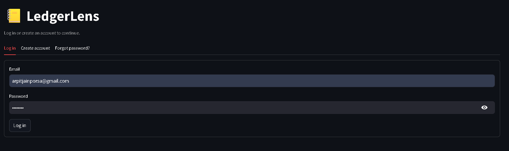
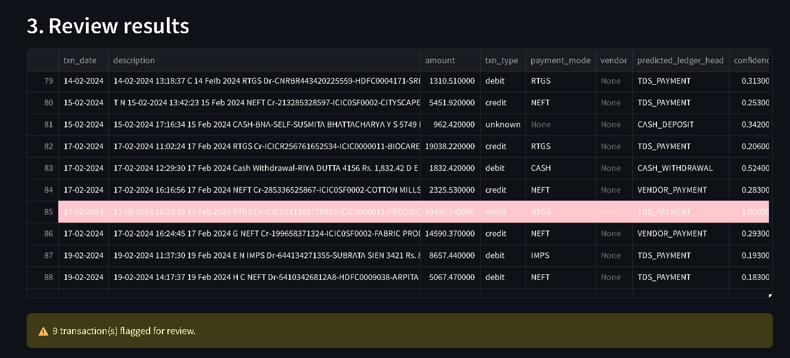
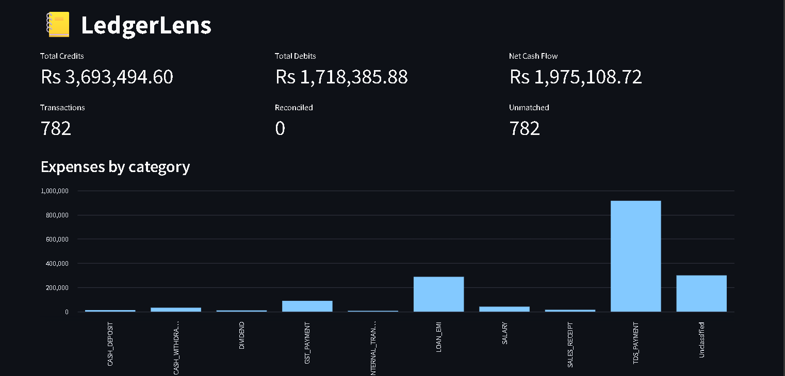
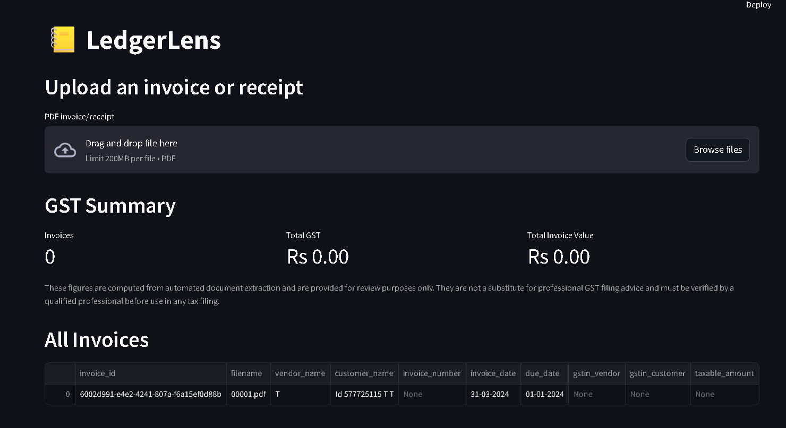
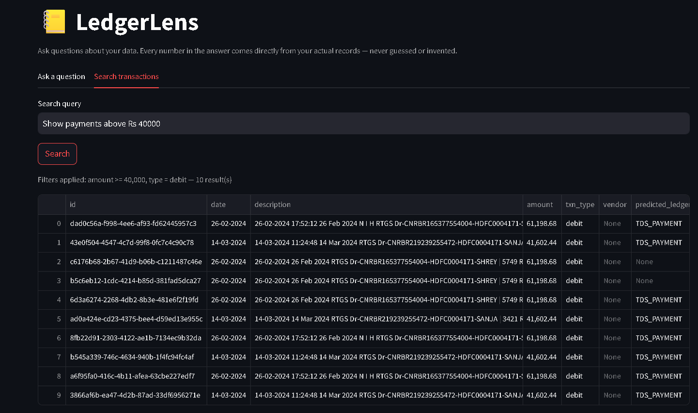
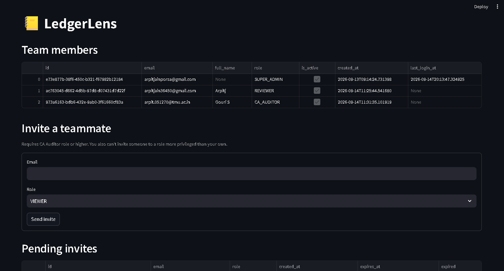
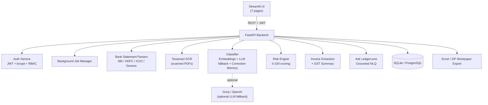

<div align="center">

# 📒 LedgerLens

**AI-powered bank statement & invoice processing for CA firms and small businesses.**

Upload a bank statement → it's parsed, classified, risk-scored, and reconciled →
export a CA-ready Excel workpaper. Built as a real multi-tenant SaaS: JWT auth,
role-based access control, team invites, and a full Streamlit UI on top of a
FastAPI backend.

[](https://www.python.org/)
[](https://fastapi.tiangolo.com/)
[](https://streamlit.io/)
[](#testing)
[](LICENSE)

[Features](#-features) •
[Screenshots](#-screenshots) •
[Quick Start](#-quick-start) •
[API](#-api-overview) •
[Architecture](#-architecture) •
[Roadmap](#-honest-roadmap--known-limitations)

</div>

---

## 📖 Overview

LedgerLens automates the single most tedious part of small-business
accounting: turning raw bank statements and invoices into clean, categorized,
audit-ready records. A CA firm currently does this by hand — manually reading
every line of a PDF statement, classifying transactions in Excel, and
cross-checking invoices one by one.

LedgerLens does it end-to-end:

```
PDF Bank Statement
   → Parsed (digital text or OCR fallback)
   → Transactions extracted & normalized
   → AI-classified into ledger heads (with a human-correctable flywheel)
   → Risk-scored (duplicates, outliers, high-value, new vendors)
   → Reconciled against invoices
   → Exported as a CA-ready Excel workpaper
```

It's built as a real product, not a script: multi-tenant (each firm's data is
isolated), role-based (5 permission levels), with real auth, rate limiting,
database migrations, and 138 automated tests.

---

## 📸 Screenshots


| | |
|---|---|
| **Login** |  |
| **Statements — classified & risk-scored** |  |
| **Dashboard** |  |
| **GST & Invoices** |  |
| **Ask LedgerLens** |  |
| **Team management** |  |

---

## ✨ Features

### Core pipeline
- **Multi-bank statement parsing** — bank detection (SBI/HDFC/ICICI/generic
  fallback) routes to the right parser, all producing one normalized
  transaction schema. Falls back to Tesseract OCR automatically for scanned PDFs.
- **Background job processing** — uploads return instantly with a job ID;
  parsing happens async while the UI polls for live progress. No frozen
  screens on large files.
- **Explainable AI classification** — every prediction comes with a
  human-readable reason, not just a confidence score.
- **Self-improving correction flywheel** — correct one transaction, and every
  future similarly-worded transaction from the same vendor is classified
  instantly from memory — no model call, no re-guessing.
- **0–100 risk scoring** — duplicate payments, statistical outliers,
  high-value transactions, round numbers, weekend timing, and new vendors,
  combined into Low/Medium/High/Critical bands.

### Accounting intelligence
- **Invoice & receipt extraction** — vendor, invoice number, dates, and full
  GST breakdown (GSTIN, CGST/SGST/IGST) from uploaded documents.
- **GST summary** — aggregated tax figures across every invoice, always
  labeled as requiring professional verification (never presented as tax advice).
- **Vendor intelligence** — spend totals, averages, new-vendor detection, per vendor.
- **Recurring payment detection** — spots rent, EMIs, and subscriptions across
  every statement you've uploaded, and predicts the next expected payment.
- **Audit trail** — every correction and every invoice extraction logged with
  full before/after context.
- **CA workpaper export** — a single statement's Excel workpaper, or a full
  multi-file ZIP package (Transaction Register, Vendor Summary, GST Summary,
  Anomaly/Risk Report) across everything uploaded so far.

### AI platform
- **"Ask LedgerLens"** — natural-language questions ("How much GST did we
  pay?", "Which vendor received the most money?") answered from real
  database aggregations. **The AI never generates a number itself** — it only
  ever retrieves and (optionally) rephrases real figures, so it can't
  hallucinate financial data. Unanswerable questions get an honest "I don't
  know" instead of a guess.
- **Natural-language search** — "Show payments above ₹1 lakh to new
  vendors" parsed into real structured filters.

### SaaS / production features
- **JWT authentication** with bcrypt password hashing.
- **5-level RBAC** (Viewer → Reviewer → Accountant → CA Auditor → Super
  Admin) — genuinely enforced on sensitive endpoints, not just decorative.
- **Multi-tenant data isolation** — proven with real tests, not just assumed:
  one firm's data is never visible to another.
- **Team invites** — a firm's admin can invite teammates by email with a
  specific role; invitees set their own password via a single-use, expiring link.
- **Password reset** via email (console-logged in dev mode, real SMTP for production).
- **Rate limiting** on login/register to slow brute-force attempts.
- **Alembic database migrations** — verified against a database built
  *purely* through migrations, with zero help from ORM auto-create.
- **Docker Compose** setup with PostgreSQL and health checks.

---

## 🏗 Architecture



Every AI component is designed to degrade gracefully: no internet or no API
key means classification still works via embeddings alone, and the AI
copilot still works via grounded database lookups. Nothing paid is ever
mandatory to run the app.

---

## 🛠 Tech Stack

| Layer | Technology |
|---|---|
| Backend | FastAPI, SQLAlchemy, Pydantic |
| Database | SQLite (dev) / PostgreSQL (production), Alembic migrations |
| Auth | JWT (PyJWT), bcrypt, slowapi (rate limiting) |
| AI/ML | sentence-transformers (embeddings), Groq/OpenAI (optional LLM fallback) |
| Document processing | pdfplumber, pytesseract, pdf2image |
| Frontend | Streamlit |
| Export | openpyxl |
| Testing | pytest, FastAPI TestClient (138 tests) |
| Deployment | Docker, Docker Compose |

---

## 🚀 Quick Start

### 1. System dependencies (only needed for OCR on scanned statements — skip if testing with digital PDFs)

```bash
# Ubuntu/Debian or WSL
sudo apt-get install poppler-utils tesseract-ocr

# macOS
brew install poppler tesseract

# Windows: download and install separately, then add both to PATH
#   Poppler: https://github.com/oschwartz10612/poppler-windows/releases
#   Tesseract: https://github.com/UB-Mannheim/tesseract/wiki
```

### 2. Python environment

```bash
python -m venv venv
# Windows:
venv\Scripts\activate
# macOS/Linux:
source venv/bin/activate

pip install -r requirements.txt
```

### 3. Configure environment

```bash
cp .env.example .env
```

Works out of the box with SQLite and embeddings-only classification. Optional:
get a free key at [console.groq.com](https://console.groq.com) and set
`GROQ_API_KEY` to enable LLM fallback for ambiguous transactions.

### 4. Run the backend

```bash
uvicorn app.main:app --reload
```

Check **http://localhost:8000/health** — every subsystem should report `ok`
or `optional`.

### 5. Run the frontend (new terminal)

```bash
streamlit run streamlit_app.py
```

Opens at **http://localhost:8501**. Register an account, upload a bank
statement, and walk through the full flow.

### 6. Run the tests

```bash
pytest -v
```

Should show `138 passed`.

---

## 🔌 API Overview

All endpoints below require a `Authorization: Bearer <token>` header unless
marked public. Full interactive docs at **http://localhost:8000/docs** once
the backend is running.

| Endpoint | Auth | Purpose |
|---|:---:|---|
| `POST /auth/register` | 🔓 | Create an account + firm |
| `POST /auth/login` | 🔓 | Log in |
| `POST /auth/forgot-password` | 🔓 | Request a password reset link |
| `POST /auth/reset-password` | 🔓 | Reset password with a valid token |
| `POST /auth/accept-invite` | 🔓 | Accept a team invite, create your account |
| `GET /health` | 🔓 | Live status of every subsystem |
| `GET /ledger-heads` | 🔓 | Classification taxonomy reference |
| `POST /statements/upload` | 🔒 | Upload a bank statement (async, returns a job ID) |
| `GET /jobs/{id}` | 🔓 | Poll background job progress |
| `POST /statements/{id}/classify` | 🔒 | Classify + risk-score a statement's transactions |
| `POST /statements/{id}/correct` | 🔒 | Correct a prediction (feeds the correction flywheel) |
| `POST /statements/{id}/reconcile` | 🔒 | Match invoice lines to transactions |
| `GET /statements/{id}/export` | 🔒 | Download one statement's Excel workpaper |
| `GET /statements/workpaper-package/full` | 🔒 CA_AUDITOR+ | Download the full multi-file ZIP package |
| `POST /invoices/upload` | 🔒 | Extract fields (incl. GST) from an invoice |
| `GET /invoices` | 🔒 | List extracted invoices |
| `GET /gst-summary` | 🔒 | Aggregated GST figures |
| `GET /vendors` | 🔒 | Vendor profiles |
| `GET /recurring-transactions` | 🔒 | Detected recurring payments |
| `GET /dashboard` | 🔒 | Financial summary |
| `GET /audit-log` | 🔒 | Change history |
| `POST /ai/ask` | 🔒 | Natural-language Q&A over real data |
| `POST /ai/search` | 🔒 | Natural-language transaction search |
| `POST /users/invite` | 🔒 CA_AUDITOR+ | Invite a teammate |
| `GET /users` | 🔒 | List your firm's team |
| `GET /users/invites/pending` | 🔒 CA_AUDITOR+ | View pending invites |

### Example

```bash
# Register
curl -X POST http://localhost:8000/auth/register \
  -H "Content-Type: application/json" \
  -d '{"email": "you@example.com", "password": "yourpassword", "firm_name": "Your Firm"}'

# Use the returned access_token on protected endpoints
curl http://localhost:8000/dashboard -H "Authorization: Bearer <token>"
```

---

## 🗄 Database Migrations

Alembic is set up and verified — a fresh database built **purely** through
`alembic upgrade head` (no ORM auto-create involved) has been confirmed to
work correctly with real register/login/health requests.

```bash
alembic upgrade head                                  # apply migrations
alembic revision --autogenerate -m "describe change"  # after editing app/models.py
alembic downgrade -1                                    # roll back one step
```

## 🐳 Running with PostgreSQL (Docker)

```bash
docker compose up
```

Set `POSTGRES_PASSWORD` and `JWT_SECRET_KEY` in `.env` first — never put
real secrets directly in `docker-compose.yml`.

---

## 🔐 Security Notes

- **Set a real `JWT_SECRET_KEY`** before any real deployment:
  `python -c "import secrets; print(secrets.token_urlsafe(32))"` — the app
  logs a loud warning on startup if you're still using the default.
- Passwords are bcrypt-hashed, never stored in plaintext.
- Login/register are rate-limited (default 5/min, 10/hour) to slow
  brute-force attempts.
- Login and password-reset responses are identical whether or not an email
  is registered, to prevent account enumeration.
- CORS defaults to localhost only — configure `ALLOWED_ORIGINS` for a real
  deployment.

---

## 📁 Project Structure

```
ledgerlens/
├── app/
│   ├── main.py                  # FastAPI app, middleware, error handling
│   ├── config.py                # All settings, loaded from .env
│   ├── models.py                # SQLAlchemy models (10 tables)
│   ├── schemas.py                # Pydantic request/response models
│   ├── exceptions.py             # Custom exceptions with user-friendly messages
│   ├── data/ledger_heads.json   # 20-category classification taxonomy
│   ├── routers/                 # 17 routers — one per feature area
│   └── services/                 # 31 services — the actual business logic
├── alembic/                     # Database migrations
├── tests/                        # 24 test files, 138 tests
├── streamlit_app.py              # 7-page frontend
├── docker-compose.yml, Dockerfile
├── requirements.txt, .env.example
└── PROGRESS.md                   # Full honest build log
```

---

## 🧪 Testing

```bash
pytest -v          # all 138 tests
pytest tests/test_auth.py -v   # a specific file
```

Tests are a mix of unit tests (parsers, risk scoring, classification logic)
and full integration tests hitting real HTTP routes through FastAPI's
TestClient, including proven multi-tenant data isolation and RBAC
enforcement — not just happy-path checks.

---

## 🗺 Honest Roadmap & Known Limitations

This project tracks its own honesty deliberately — see
[`PROGRESS.md`](PROGRESS.md) for the full build log, including real bugs
found and fixed along the way. Summary of what's not done yet:

- SBI/HDFC/ICICI parsers detect the right bank correctly, but their column
  parsing hasn't been validated against a real statement from those banks.
- PostgreSQL and Docker Compose are configured correctly but haven't been
  run end-to-end against a live instance during development.
- No MFA, no CI/CD pipeline, no pagination on list endpoints yet.
- File storage is local disk — would need migrating to S3-compatible
  storage before scaling past a single server.
- SMTP email sending is implemented but untested against a real inbox.

---

## 🤝 Contributing

This started as a college final-year project and grew into a full
production-style build. Issues and PRs are welcome — please run the test
suite (`pytest -v`) before submitting.

## 📄 License

[MIT](LICENSE)

## 👤 Author

**Arpit Jain**
B.Tech CSE (AI), Teerthanker Mahaveer University
[LinkedIn](https://linkedin.com/in/arpit-jain-294729331) • [GitHub](https://github.com/arpitjain985)
